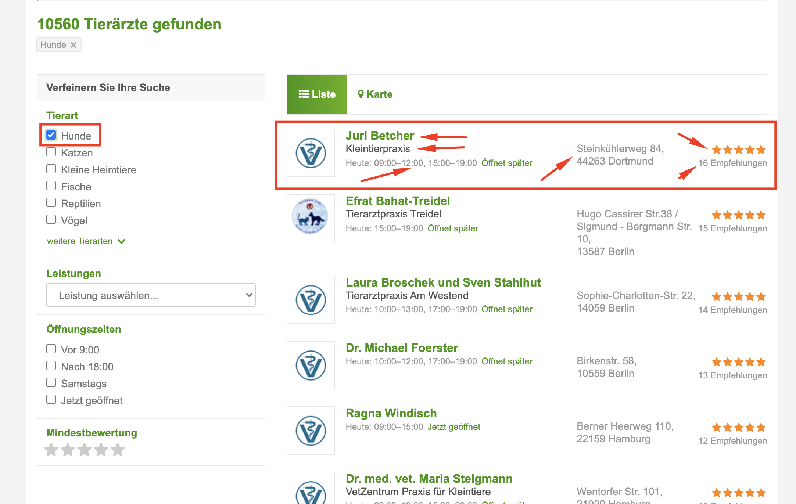

# test-parse-veterinarians

This program extracts the information about the 
veterinarians indicated on the image and writes the obtained data to a csv file.



Python must be already installed

```shell
git clone git@github.com:Igor-Cegelnyk/test-parce-veterinarians.git
cd ScrapyZooplus/
python3 -m venv venv
source venv/bin/activate (on macOS/Linux) #source venv/Scripts/activate (on Windows)
pip install -r requirements.txt
```

## Features

* The program execution time is 0.327085 second;
* The program parse 5 page;
* The veterinarian.csv has 100 positions.